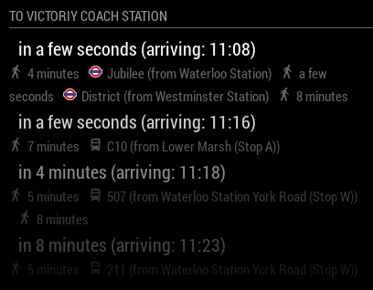

[](https://codeclimate.com/github/CFenner/MMM-LocalTransport)
[](https://choosealicense.com/licenses/mit/)

# MMM-LocalTransport

This is a module for MagicMirror² to display the next local transport connection between an origin and destination.


## Usage

You need to install the module for your MagicMirror.

### Installation

Navigate into your MagicMirror's modules folder:

```shell
cd ~/MagicMirror/modules
```

Clone this repository:

```shell
git clone https://github.com/CFenner/MMM-LocalTransport
```

Configure the module in your config.js file.

### Configuration

Add module configuration to config.js.

```js
{
  module: 'MMM-LocalTransport',
  position: 'ANY_POSITION',
  config: {
    api_key: 'YOUR_API KEY',
    origin: 'YOUR_ORIGIN',
    destination: 'YOUR_DESTINATION'
  }
},
```

|Option|Description|
|---|---|
|`apiKey`|The API key, which can be obtained [here](https://developers.google.com/maps/documentation/directions/).<br><br>This value is **REQUIRED**|
|`origin`|The start location.<br><br>**Example:** `Mannheim HBF`<br>This value is **REQUIRED**|
|`destination`|The target location.<br><br>**Example:** `Frankfurt HBF`<br>This value is **REQUIRED**|
|`maximumEntries`|Maximum number of routes to display. Less routes will be shown if less are returned by Google. Routes will be sorted by arrival time. This option should take an integer value between `1` and `5`.<br><br>**Default value:** `3`|
|`updateInterval`|How often does the content need to be fetched? (Minutes) Note that the module refreshes every 15 seconds to always display an accurate estimate when you need to leave.<br><br>**Default value:** `5`|
|`animationSpeed`|Speed of the update animation. (Seconds)<br><br>**Default value:** `1`|
|`displayStationLength`|Number of characters of the departure station for each transport mode to display. <br>`0` means display all, <br>`-1` means don't show the departure station<br><br>**Default value:** `0`|
|`displayArrival`|Boolean if the arrival time should be shown in the header for each option.<br><br>**Default value:** `true`|
|`displayWalkType`|String how detailed the walking segments should be shown. <br> `'none'` means to not display anything,<br> `'short'` means to display the symbol, the time and the short version of the unit or <br> `'long'` means that a symbol, the time and the long string for the unit is displayed. This options is default if an invalid string is supplied.<br><br>**Default value:** `'short'`|
|`maxWalkTime`|Maximum time you are willing to walk between stations in minutes<br><br>**Default value:** `10`|
|`maxModuleWidth`|Maximum width of the module in pixel. Unlimited when set to `0`. This option can be used to make the module shorter in case of very long lines for directions. <br><br>**Default value:** `0`|
|`fade`|Boolean if a fade should be applied - same as for calendar module<br><br>**Default value:** `true`|
|`fadePoint`|Percentage, where the fade should start. This should be a value between 0 and 1 - same as for calendar module<br><br>**Default value:** `0.1`|
|`showColor`|Boolean if transport symbols should be displayed in color (Note: symbols for default transport modes are always in grey)<br><br>**Default value:** `true`|
|`language`|Language to display information in - german `de` or english `en`<br><br>**Default value** `is same as defined in the main config file`|
|`units`|Units to use - `metric` or `imperial`<br><br>**Default value** `is same as defined in the main config file`|
|`timeFormat`|`24` or `12` hour clock for displaying the arrival time<br><br>**Default value** `is same as defined in the main config file`|

## Preview of various settings

```js
{
  module: 'MMM-LocalTransport',
  header: 'to Victoriy Coach Station',
  position: 'top_left',
  config: {
    api_key: 'MYG00GLEAP1KEY',
    origin: 'Waterloo Station, London, United Kingdom',
    destination: 'Victoria Coach Station, London, United Kingdom',
    maximumEntries: 4,
    maxWalkTime: 15,
    displayWalkType: 'full',
    maxModuleWidth: 400
  }
},
```



```js
{
  module: 'MMM-LocalTransport',
  header: 'nach Berlin',
  position: 'top_right',
  config: {
    api_key: 'MYG00GLEAP1KEY',
    origin: 'Bahnhof Hamburg Altona, Hamburg, Germany',
    destination: 'Berlin Hauptbahnhof, Berlin, Germany',
    maximumEntries: 6,
    maxWalkTime: 15,
    displayStationLength: -1,
    displayWalkType: 'none',
    displayArrival: false,
    language: 'de'
  }
},
```


```js
{
  module: 'MMM-LocalTransport',
  header: 'to Museum of Art',
  position: 'top_left',
  config: {
    api_key: 'MYG00GLEAP1KEY',
    origin: 'MetLife Stadium, 1 MetLife Stadium Drive, East Rutherford, NJ 07073, US',
    destination: '1000 5th Ave, New York, NY 10028, US',
    maximumEntries: 3,
    maxWalkTime: 30,
    displayStationLength: 10
  }
},
```


## Special Thanks

Thanks to [SamLewis0602](https://github.com/SamLewis0602) for his module [MMM-Traffic by SamLewis0602](https://github.com/SamLewis0602/MMM-Traffic) on which this one is based on.
